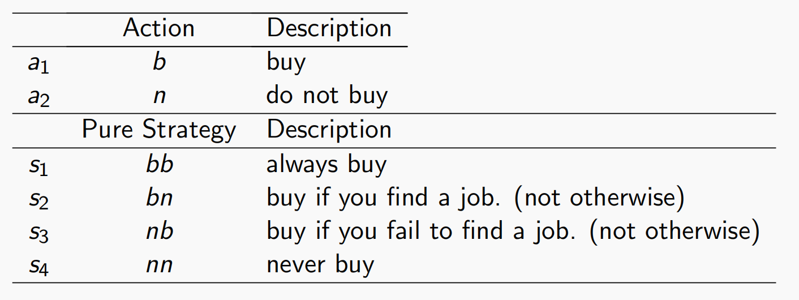
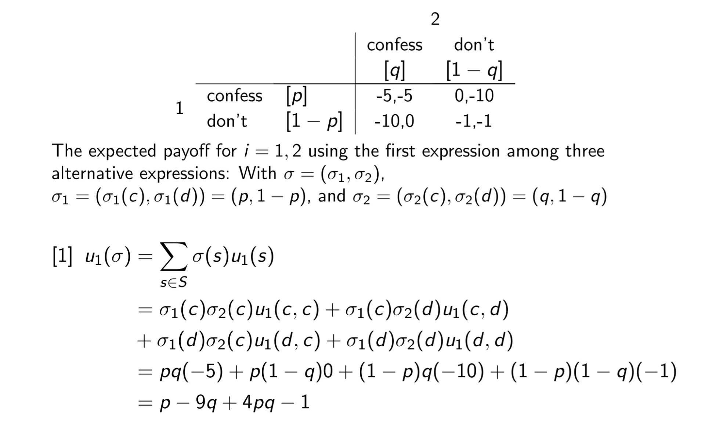
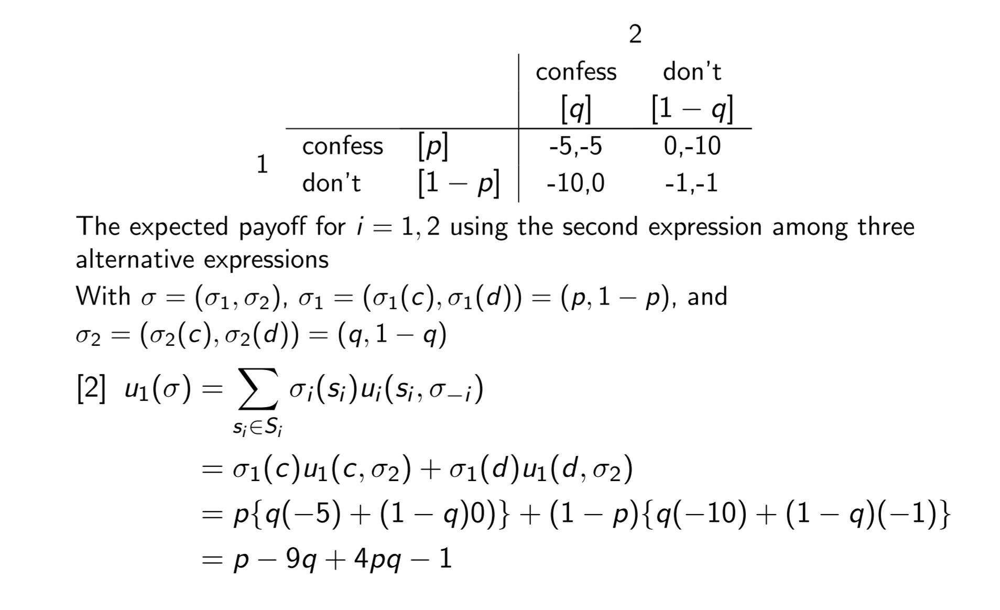
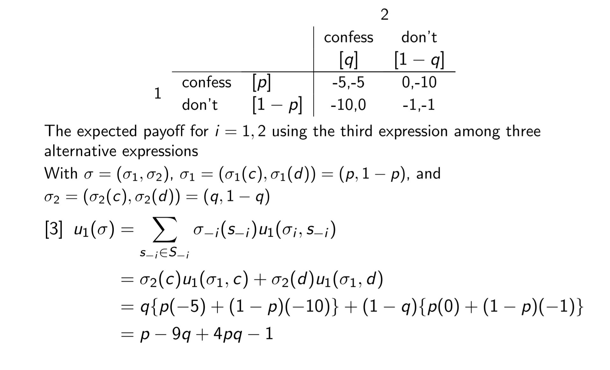

## Action and Pure Strategy

## Prisoner's Dilemma

---

- Two criminals, i=1,2 are arrested for a serous crime and detained in separate cells. During separate interrogation,
	- If both "confess", they will be jailed for 5 years.
	- If bot "don't confess", they will be jailed for 1 year.
	- If player 1 confesses while player 2 does not, then player 1 will be freed and player 2 will be jailed for 10 years.
	- Vice versa

Formally define the game as 
$$\Gamma=\{I,\{S_i\}_{i\in N}, \{\nu_i(\cdot)\}_{i\in N}\}$$
$$I=\{1, 2\}$$
$$S_1=S_2=\{c,d\}$$
$$u_1(c,c)=u_2(c,c)=-5$$
$$u_1(c,d)=u_2(d,c)=0$$
$$u_1(d,c)=u_2(c,d)=-10$$
$$u_1(d,d)=u_2(d,d)=-1$$

### Prisoner's Dilemma: Payoff

- confess is a **strictly dominant strategy** of i = 1 if 
	- $u_1(c,c)>u_1(d,c)$ and 
	- $u_1(c,d)>u_1(d,d)$