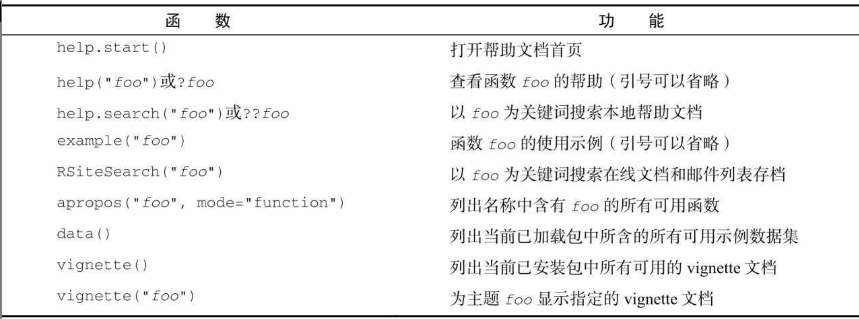
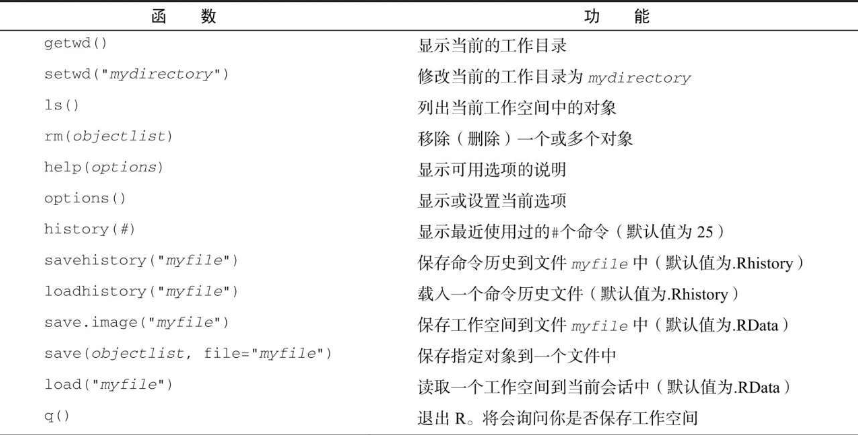
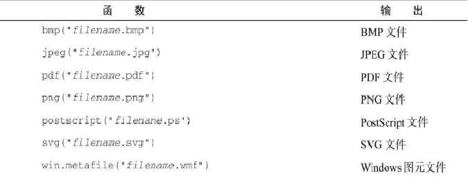
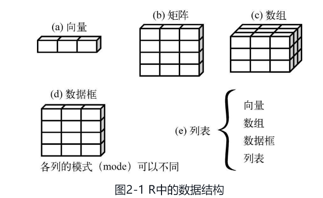
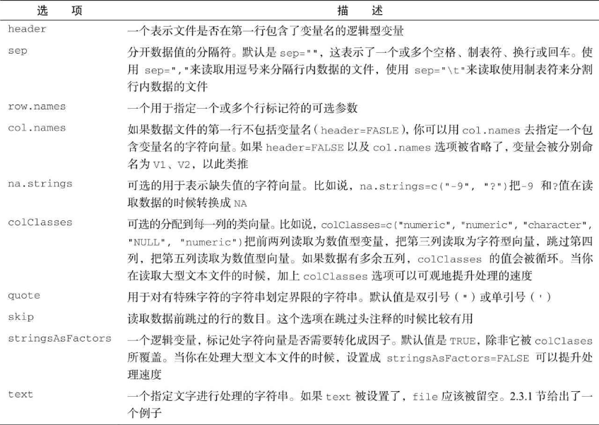
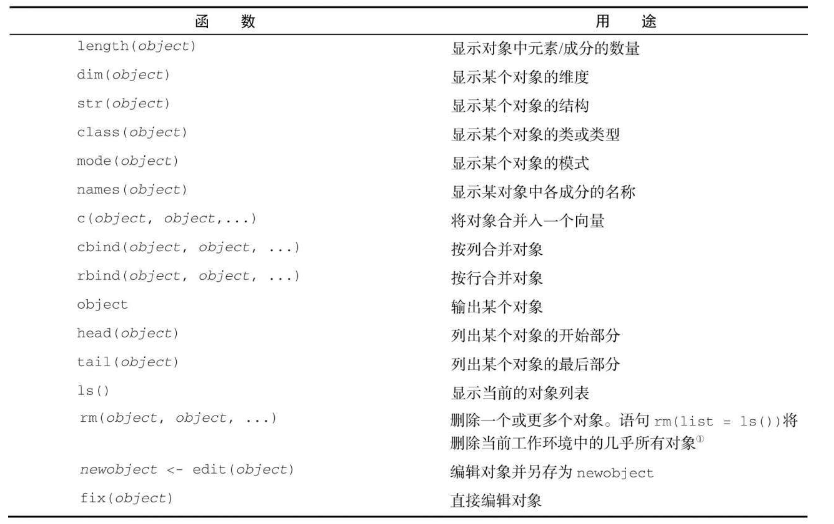
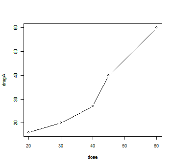

# 入门

## 获取帮助

---



## 工作空间

---



示例：
```R
setwd("C:/myprojects/project1")
options()
options(digits=3) # 三位数字
x <- runif(20) # 20个均匀分布
summary(x)
hist(x) # 直方图
q()
```

## 输入和输出

### 输入

`source("filename")`可在当前会话中执行一个脚本。

### 文本输出

`sink("filename")`将输出重定向到文件中，默认覆盖。
`append=TRUE`可将文本追加到文件后
`split=TRUE`可将输出同时发送到屏幕和输出文件中

### 图形输出



### 示例

```R
source("script1.R")
sink("myoutput", append=TRUE, split=TRUE)
pdf("mygraphs.pdf")
source("script2.R")
sink() # 关闭输出到文件
dev.off() # 将输出返回到终端
source("script3.R")
```

## 结果重用

---

```R
lm(mpg~wt, data=mtcars, data=mtcarts)
lmfit <- lm(mpg~wt, data=mtcarts) # 保存结果
summary(lmfit) # 显示分析结果的统计概要
plot(lmfit) # 生成回归诊断图形
predict(lmfit, mynewdata) # 进行预测
```

# 创建数据集

数据集通常是由数据构成的一个矩形数组，行表示**观测**，列表示**变量**。

不同的行业对于数据集的行和列叫法不同。统计学家称它们为观测（observation）和变量（variable），数据库分析师则称其为记录（record）和字段（field），数据挖掘和机器学习学科的研究者则把它们叫作示例（example）和属性（attribute）

## 数据结构

---



### 向量

```R
# 单个向量中的数据必须拥有相同的类型或模式
a <- c(1, 2, 3)
b <- c("one", "two", "three")
c <- c(TRUE, TRUE, FALSE)
```

> 标量是只含一个元素的向量， 如`f <- 3`

```R
> a <- c(5:20) # 创建5-20的数组
> a
 [1]  5  6  7  8  9 10 11 12 13 14 15 16 17 18 19 20
> a[1:5] # 取元素1-5， r中索引从1开始
[1] 5 6 7 8 9
> a[c(1, 3, 5)] # 取第1，3，5个元素
[1] 5 7 9
>
```
> R语言中索引从1开始，不同于一般编程语言的从0开始

### 矩阵

矩阵是一个二维数组，只是每个元素都拥有相同的模式（数值型、字符型或逻辑型）

```R
y <- matrix(1: 20, nrow = 5, ncol = 4)

cells <- c(1, 26, 24, 68)
rnames <- c("R1", "R2")
cnames <- c("C1", "C2")
mymatrix <- matrix(cells, nrow = 2, ncol = 2, byrow = TRUE, # 按行填充,默认按列
				  dimnames = list(rnames, cnames))
```

### 数组

数组array与矩阵类似，但是维度可以大于2
```R
myarray <- array(*vector, *dimensions, dimnames)
```

```R
> dim1 <- c("a1", "a2")
> dim2 <- c("b1", "b2", "b3")
> dim3 <- c("c1", "c2", "c3", "c4")
> z <- array(1:24, c(2, 3, 4), dimnames = list(dim1, dim2, dim3))
> z
, , c1

   b1 b2 b3
a1  1  3  5
a2  2  4  6

, , c2

   b1 b2 b3
a1  7  9 11
a2  8 10 12

, , c3

   b1 b2 b3
a1 13 15 17
a2 14 16 18

, , c4

   b1 b2 b3
a1 19 21 23
a2 20 22 24
```

### 数据框

```R
mydata <- data.frame(col1, col2, col3, ...)
```

```R
> patientID <- c(1, 2, 3, 4)
> age <- c(25, 34, 28, 53)
> diabetes <- c("type1", "type2", "type1", "type1")
> status <- c("poor", "improved", "excellent", "poor")
# 每一列数据的模式必须唯一
> patientdata <- data.frame(patientID, age, diabetes, status)
> patientdata
  patientID age diabetes    status
1         1  25    type1      poor
2         2  34    type2  improved
3         3  28    type1 excellent
4         4  53    type1      poor

# 选取特定行
> patientdata[1:2, ]
  patientID age diabetes   status
1         1  25    type1     poor
2         2  34    type2 improved
# 选取特定列（观测变量）
> patientdata[, 1:2]
  patientID age
1         1  25
2         2  34
3         3  28
4         4  53
# 通过$选取列
> patientdata$age
[1] 25 34 28 53

# table获取联列表
> table(patientdata$diabetes, patientdata$status)

        excellent improved poor
  type1         1        0    2
  type2         0        1    0
```

#### attach(), detach() and with()

在每个变量名前都键入一次patientdata$可能会让人生厌，所以不妨走一些捷径。可以联合使用函数attach()和detach()或单独使用函数with()来简化代码。

```R
summary(mtcarts$mpg)
plot(mtcars$mpg, mtcars$disp)
plot(mtcars$mpg, mtcars$wt)
```
以上代码可以写成
```R
atach(mtcars)
	summary(mpg)
	plot(mpg, disp)
	plot(mpg, wt)
detach(mtcars)
```

当对象名称不止一个时，这种方法有局限性，可能会与已存在变量冲突
另一种方式是使用函数with()
```R
with(mtcars, {
	print(summary(mpg))
	plot(mpg, disp)
	plot(mpg, wt)
})
```

如果需要创建在with() 结构以外存在的对象，使用特殊赋值符<<-替代<-
```R
with(mtcars, {
	nokeepstats <- summary(mpg)
	keepstats <<- summary(mpg)
})
```

#### 实例标识符
实例标识符可以通过rowname选项指定
```R
patientdata <- data.frame(patientID, age, diabetes, status, row.names = patientID)
```
将patientID指定为R中标记各类打印输出和图形中实例名称所用的变量

### 因子factor

类别变量和有序类别变量在R中称为因子(factor)

**字符型变量**
```R
> diabetes
[1] "type1" "type2" "type1" "type1"
> diabetes <- factor(diabetes) # 无序型
> diabetes
[1] type1 type2 type1 type1
Levels: type1 type2

> status
[1] "poor"      "improved"  "excellent" "poor"
# 有序型
status <- factor(status, ordered = TRUE,
				 level = c("poor", "improved", "excellent")
> status
[1] poor      improved  excellent poor
Levels: poor < improved < excellent
>
```

**数值型变量**可以用levels和labels参数来编码成因子。
```R
sex <- factor(sex, levels = c(1, 2), labels = c("male", "female"))
```

### 列表list
列表允许你整合若干（可能无关的）对象到单个对象名下。
```R
mylist <- list(name1 = obj1, name2 = obj2, ...)
```

## 数据的输入

---

### 键盘输入

edit()可以打开一个临时的编辑器

可以直接嵌入数据集：
```R
> mydatatxt <- "
+ age gender weight
+ 25 m 166
+ 30 f 115
+ 18 f 120
+ "
> mydata <- read.table(header=TRUE, text=mydatatxt)
> mydata
  age gender weight
1  25      m    166
2  30      f    115
3  18      f    120
```

### 从带分隔符的文本文件导入数据

```R
mydataframe <- read.table(file, options)
```



默认地，`read.table()` 把字符变量转化为因子，这并不一定都是我们想要的情况。可以加上 `stringsAsFactors=FALSE` 对所有的字符变量去掉这个行为。
此外，可以用 `colClasses` 选项对每一列都指定一个类
```R
grades <- read.table("studentgrades.csv", header=TRUE, 
					 row.names="StudentID", sep=",",
					 colClasses=c("character", "character", "character",
					 "numeric", "numeric", "numeric"))
```

### 导入excel数据
```R
library(xlsx)
workbook <- "c:/myworkbook.xlsx"
mydataframe <- read.xlsx(workbook, 1)
```
其他的包：XLConnect(依赖于JAVA), openxlsx

### 导入XML数据

XML包

### 从网页抓取数据

网页上的文字可以使用函数 `readLines()` 来下载到一个R的字符向量中，然后使用如 `grep()` 和 `gsub()` 一类的函数处理它。对于结构复杂的网页，可以使用RCurl包和XML包来提取信息。
twitteR来获取Twitter数据， Rfacebook来获取Facebook数据……
<a href="https://cran.r-project.org/web/views">CRAN Web Views</a>
中查看全面列表

### 导入SPSS数据

```R
install.packages("Hmisc")
library(Hmisc)
# use.value.labels表示让函数将带有值标签的变量导入为R中水平对应相同的因子
mydataframe <- spss.get("mydata.sav", use.value.labels=TRUE)
```

### 导入Stata数据

```R
library(foreign)
mydataframe <- read.dta("mydata.dta")
```

## 数据集的标注

---

这种标注包括为变量名添加描述性的标签，以及为类型变量中的编码添加值标签

### 变量标签

只能修改变量名（不好用）
```R
namesJ(patientdata)[2] <- "Age at hospitalization (in years)"
```

### 值标签

假设有一个名为gender的变量，其中1表示男性，2表示女性，可以使用：
```R
patientdata$gender <- factor(patientdata$gender, 
							 levels=c(1, 2)
							 labels=c("male", "female"))
```

## 处理数据对象的实用函数

---



# 图形初阶

## 简单例子

---

```R
dose <- c(20, 30, 40, 45, 60)
drugA <- c(16, 20, 27, 40, 60)
drugB <- c(15, 18, 25, 31, 40)
plot(dose, drugA, type="b") # type="b"表示同时绘制点和线
```

