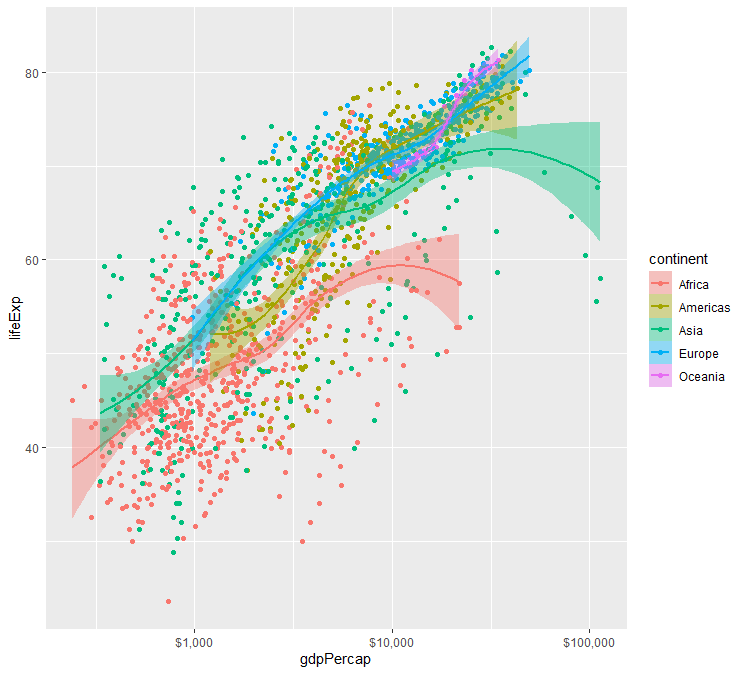

```R
library(ggplot2)
library(gapminder) # 数据集

gm <- gapminder

p <- ggplot(data = gm, mapping = aes(
                        x = gdpPercap,
                        y = lifeExp,
                        color = continent,
                        fill = continent
                        ))

print(
	p + 
	geom_point() + 
	geom_smooth(method = "loess") + 
	scale_x_log10(labels=scales::dollar)
)
```


