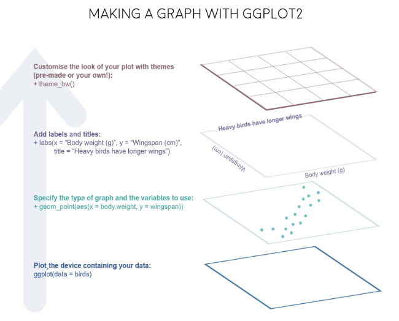

# 基本概念


```r
library(ggplot2)
library(gapminder) # 数据集

gm <- gapminder

p <- ggplot(data = gm, mapping = aes(
    x = gdpPercap,
    y = lifeExp,
    color = continent,
    fill = continent
))

print(
    p +
        geom_point() +
        geom_smooth(method = "loess") +
        scale_x_log10(labels = scales::dollar)
)
```

```
## `geom_smooth()` using formula = 'y ~ x'
```

}}index_files/figure-html/unnamed-chunk-1-1.png" width="672" />



这个过程类似画一幅水彩画，有很多图层。

## 图形部件

一张统计图就是从数据到几何形状(geometic object, geom)所包含的图形属性(aesthetic attribute, aes)的一种映射

1. data: 数据框 data.frame
2. aes: 数据框中的数据变量**映射**到图形属性
   - x
   - y
   - color
   - size
   - shape
   - alpha
3. geoms: 集合形状
   - geom_bar()
   - geom_density()
   - geom_freqpoly()
   - geom_histogram()
   - geom_violin()
   - geom_boxplot()
   - geom_col()
   - geom_point()
   - geom_smooth()
   - geom_tile()
   - geom_density2d()
   - geom_hex()
   - geom_count()
   - geom_text()
   - geom_sf()
4. stats
5. scales
6. coord
7. facet
8. layer
9. theme
10. save

# 开始

检查是否有缺失值

```r
library(gapminder)
library(tidyverse)
gapdata <- gapminder
gapdata %>%
    summarise(
        across(everything(), ~ sum(is.na(.)))
    )
```

```
## # A tibble: 1 × 6
##   country continent  year lifeExp   pop gdpPercap
##     <int>     <int> <int>   <int> <int>     <int>
## 1       0         0     0       0     0         0
```

# 基本绘图

## 柱状图

用于离散变量


```r
gapdata %>%
    ggplot(aes(x = continent)) +
    geom_bar()
```

}}index_files/figure-html/unnamed-chunk-3-1.png" width="672" />

```r
gapdata %>%
    ggplot(aes(x = reorder(continent, continent, length))) +
    geom_bar()
```

}}index_files/figure-html/unnamed-chunk-3-2.png" width="672" />

```r
gapdata %>%
    ggplot(aes(x = reorder(continent, continent, length))) +
    geom_bar() +
    coord_flip()
```

}}index_files/figure-html/unnamed-chunk-3-3.png" width="672" />

```r
gapdata %>% count(continent)
```

```
## # A tibble: 5 × 2
##   continent     n
##   <fct>     <int>
## 1 Africa      624
## 2 Americas    300
## 3 Asia        396
## 4 Europe      360
## 5 Oceania      24
```

```r
gapdata %>%
    distinct(continent, country) %>% # exclude fields with same continent & contry
    ggplot(aes(x = continent)) +
    geom_bar()
```

}}index_files/figure-html/unnamed-chunk-3-4.png" width="672" />

## 直方图

用于连续变量


```r
gapdata %>%
    ggplot(aes(lifeExp)) +
    geom_histogram()
```

```
## `stat_bin()` using `bins = 30`. Pick better value with `binwidth`.
```

}}index_files/figure-html/unnamed-chunk-4-1.png" width="672" />

```r
gapdata %>%
    ggplot(aes(lifeExp)) +
    geom_histogram(binwidth = 1) # geom_histograms()默认使用position="stack"
```

}}index_files/figure-html/unnamed-chunk-4-2.png" width="672" />

```r
gapdata %>%
    ggplot(aes(x = lifeExp, fill = continent)) +
    geom_histogram()
```

```
## `stat_bin()` using `bins = 30`. Pick better value with `binwidth`.
```

}}index_files/figure-html/unnamed-chunk-4-3.png" width="672" />

## 频次图


```r
gapdata %>%
    ggplot(aes(x = lifeExp, color = continent)) +
    geom_freqpoly()
```

```
## `stat_bin()` using `bins = 30`. Pick better value with `binwidth`.
```

}}index_files/figure-html/unnamed-chunk-5-1.png" width="672" />
